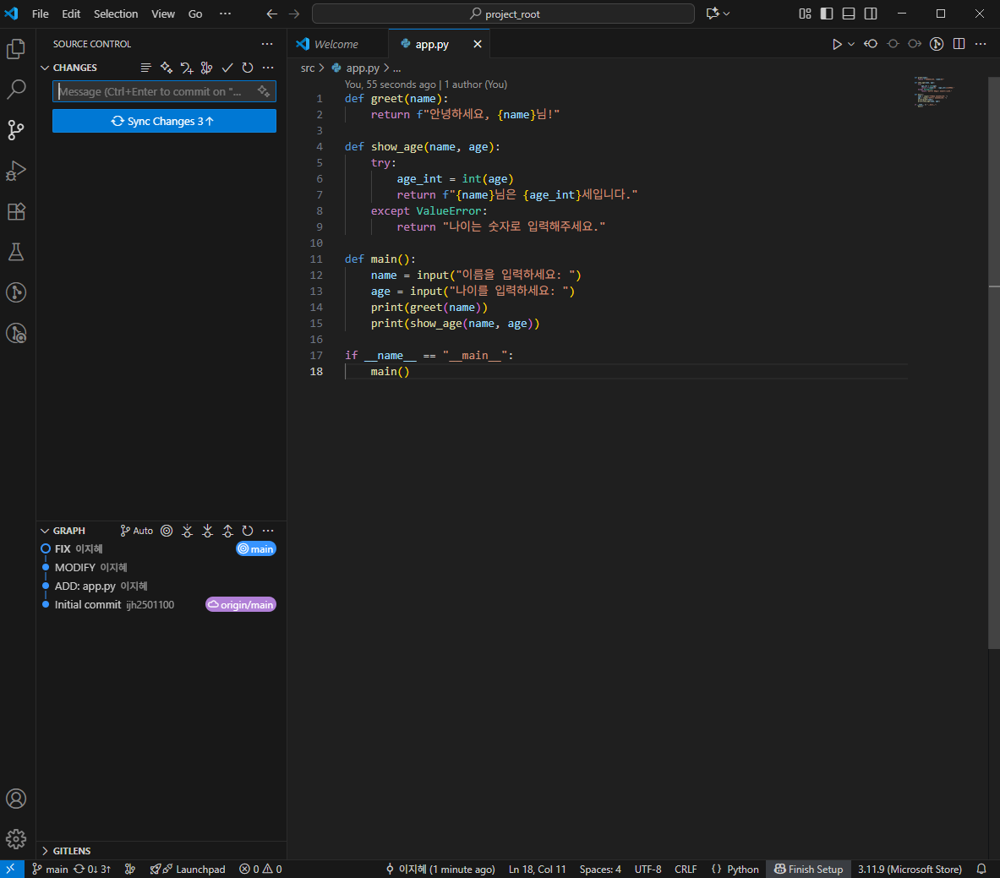
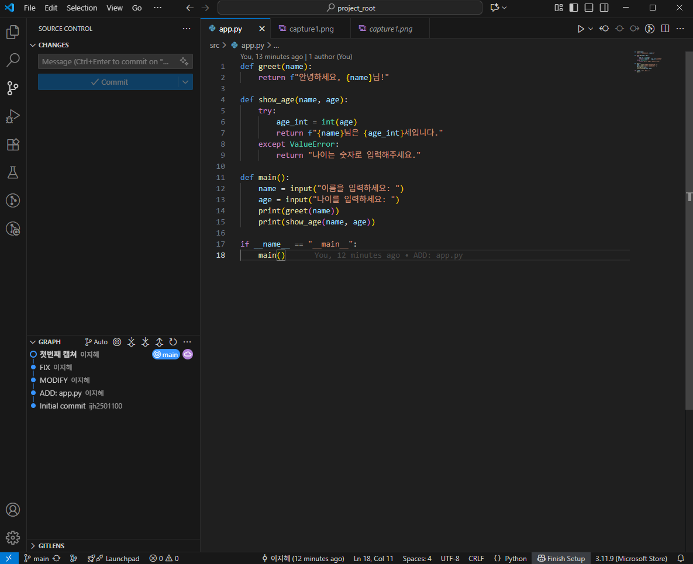

# project_root
# Python GitHub 과제

## 1. 과제 개요
- VS Code에서 Python 프로젝트를 생성하고 Git/GitHub을 활용하여 버전 관리 및 저장소 연동을 실습한다.  
- commit 메시지 규칙:  
  - 첫 번째: `ADD: ...`  
  - 이후 기능 추가: `MODIFY: ...`  
  - 코드 수정: `FIX: ...`  

---

## 2. 프로젝트 폴더 구조
```
project_root/
 ├─ src/
 │   └─ app.py
 ├─ doc/
 │   └─ images/
 │       ├─ capture1.png
 │       └─ capture2.png
 └─ README.md
```

---

## 3. 수행 과정
1. **src/app.py 작성 및 첫 commit**
   - commit 메시지: `ADD: app.py`  
   - 기능: 
   [def greet(name):
    return f"안녕하세요, {name}님!"

   def main():
    name = input("이름을 입력하세요: ")
    print(greet(name))

   if __name__ == "__main__":
    main()]  

2. **두 번째 commit**
   - commit 메시지: `MODIFY` 
   - 수정/추가한 내용: 
   [def show_age(name, age):
    return f"{name}님은 {age}세입니다."
    age = input("나이를 입력하세요: ")
    print(greet(name))
    print(show_age(name, age))]  

3. **세 번째 commit**
   - commit 메시지:`FIX`
   - 수정/추가한 내용: 
   [except ValueError:
        return "나이는 숫자로 입력해주세요."]  

---

## 4. 캡처 이미지
- `capture.png` → commit 완료 상태 화면  
- `capture2.png` → GitHub push → pull 후 VS Code 화면  

예시:  
  
  

---

## 5. GitHub Repository URL
- URL: [https://github.com/ijh2501100/project_root.git]  

---

## 6. 느낀 점 (선택 사항)
- 이번 과제를 하면서 배운 점: 이번 과제를 수행하면서 Python 프로젝트를 구성하고 git과 gitHub를 활용한 버전 관리 과정을 직접 경험할 수 있었습니다. 처음에는 commit과 push 과정이 어렵게 느껴졌지만, ADD, MODIFY, FIX 규칙을 적용하면서 체계적으로 코드를 관리하는 방법을 배웠습니다. 코드를 수정하고 버그를 고치면서 commit으로 기록을 남기니, 과거 작업 내역을 쉽게 확인하고 추적할 수 있다는 점이 매우 유용하다는 것을 알게 되었습니다. 또한 gitHub와 연동하여 원격 저장소에 코드를 올리고, 화면 캡처를 통해 변경 사항을 시각적으로 확인하면서 협업 환경의 기본 개념도 이해하게 되었습니다. 마지막으로 README.md를 작성하며 프로젝트 수행 과정을 정리하면서, 문서화의 중요성과 다른 사람과 협업할 때 필요한 기록 습관을 자연스럽게 익힐 수 있었습니다.
- Git/GitHub을 활용하며 어려웠던 점: 아직 git/github를 사용하는 게 익숙하지 않아서 과제를 수행하는 것보다 수행하기 전에 과제의 무엇을 어떻게 활용해서 해야하는지 해석하는 것이 더 어려웠습니다. 특히나 이번에는 처음으로 VScode를 사용하여 과제를 해보았는데 전에 배웠던 것보다 많이 헷갈려서 이전의 과제보다 어려운 점이 훨씬 많았던 것 같습니다.
- 앞으로 더 해보고 싶은 것: 이번 과제를 통해 git과 gitHub의 기본적인 사용법을 익혔지만, 앞으로는 다양한 협업 프로젝트에도 활용해보고 싶습니다. 특히 여러 사람과 함께 코드를 관리하며 더 많은 용도 사용법을 익혀서 능숙하게 사용해 보고 싶습니다. 그리고 앞으로 시간이 많이 지나고 더 많은 것들을 배우고 나면 나중에는 나만의 프로젝트를 만들어서 오픈소스로 공개해 보는 것이 목표입니다.
